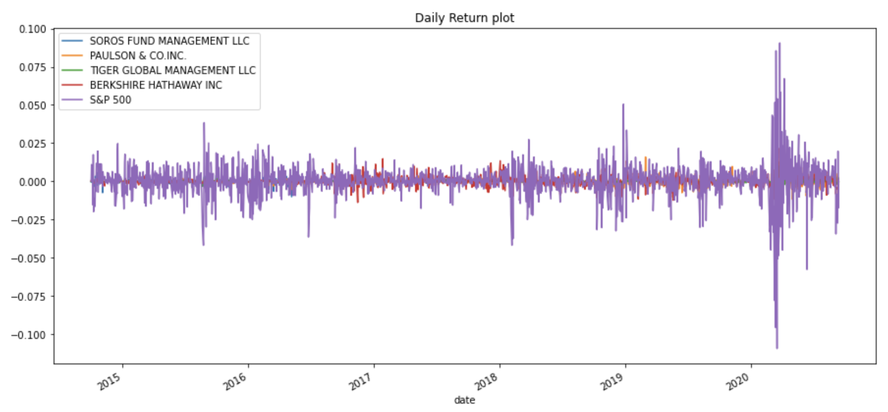
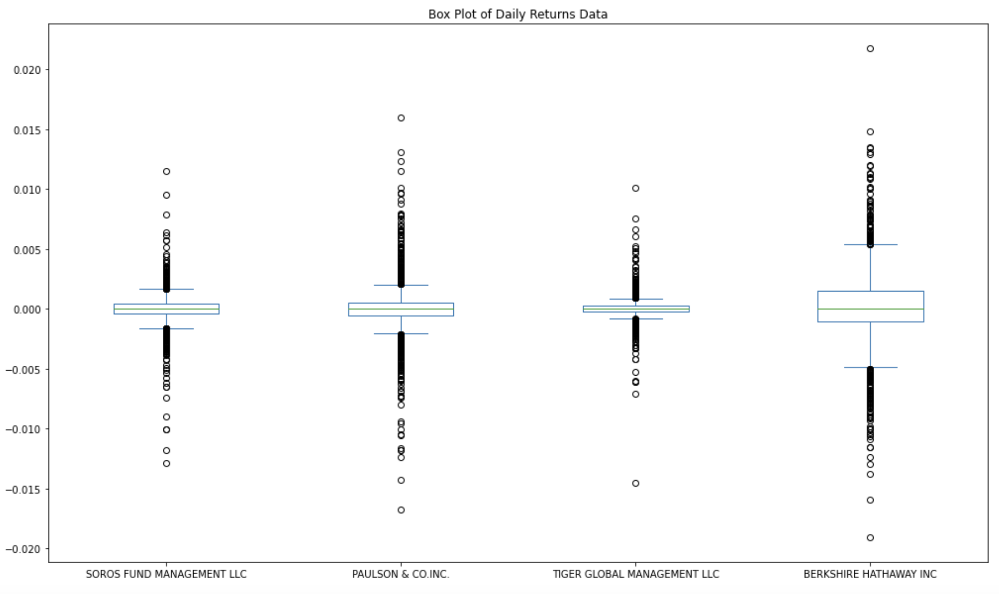
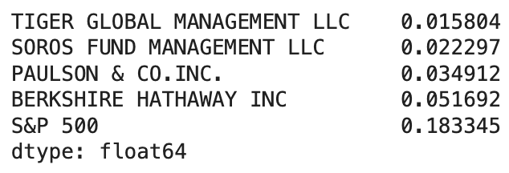
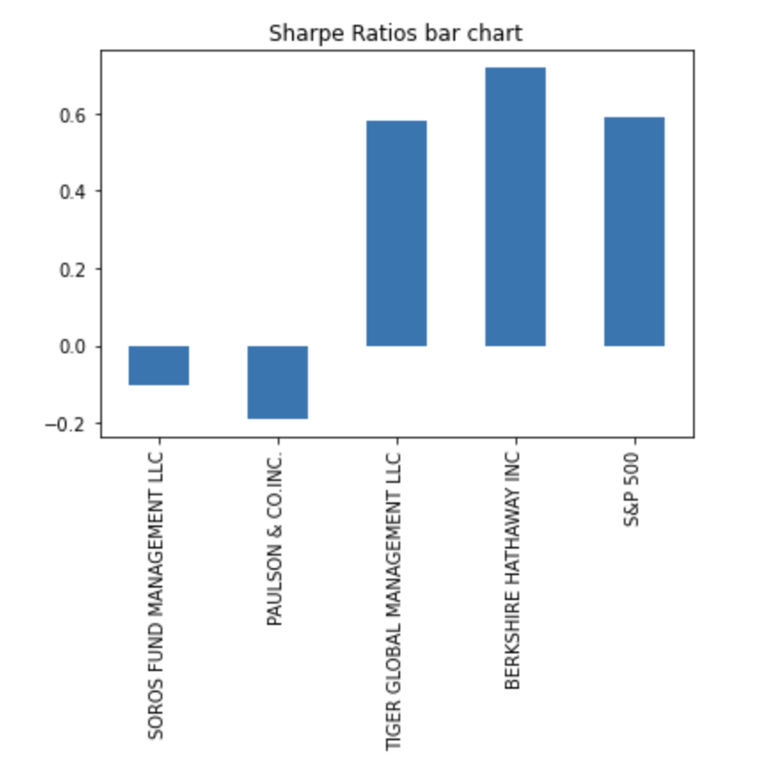

<meta name="msvalidate.01" content="22E26E71FA9EEE3C8FCBA57297784F5B" />

# Quantitative Portfolio Analysis 

*by KELVIN KISSI*

---

## Background

In this Jupyter Notebook, I use Python and Pandas quantitative analytical tools to identify the top-performing portfolios based on volatility, returns, risk, and Sharpe ratios. Through the analysis and visualization of these key metrics, I achieved three main objectives:

* Read in and Wrangle Returns Data - Preparing the Data
* Determine Success of Each Portfolio - Conducting Quantitative Analysis
* Choose and Evaluate Custom Portfolio - Building a Custom Portfolio (including data preparation and quantitative analysis)
   
---

   
   [Source Code](https://github.com/kelvinkissi/Quantitative-Analysis-With-Pandas/blob/master/risk_return_analysis.ipynb)
   

---

## Read and Clean Data

Read each CSV file into a DataFrame using Pandas. Next, clean the data by converting dates to a DateTimeIndex, identifying and removing all null values, and adjusting data types as necessary. Finally, concatenate all the DataFrames into a single DataFrame to perform quantitative analysis and determine if any portfolios outperform the S&P 500.

## Performance Analysis

---

According to the cumulative return data and visualizations, none of the four fund portfolios surpassed the performance of the S&P 500.

---

Berkshire Hathaway exhibited the highest volatility with the widest range, while Soros showed the least volatility.

---

## Risk Analysis 

Annualized Standard Deviation (252 trading days) of the 4 portfolios and the S&P 500.

---

A 21-day rolling window for visualizing the rolling standard deviations of the four fund portfolios.

---

## Shape Ratios

The Sharpe Ratios plot indicates that BERSHIRE HATHAWAY INC provides the best risk-return profile, while PAULSON & CO INC presents the least favorable risk-return characteristics.

---

## Conclusion

After completing the quantitative analysis of various portfolios, I recommend including the S&P 500 and BERSHIRE HATHAWAY INC in our firm's fund offerings.

 

